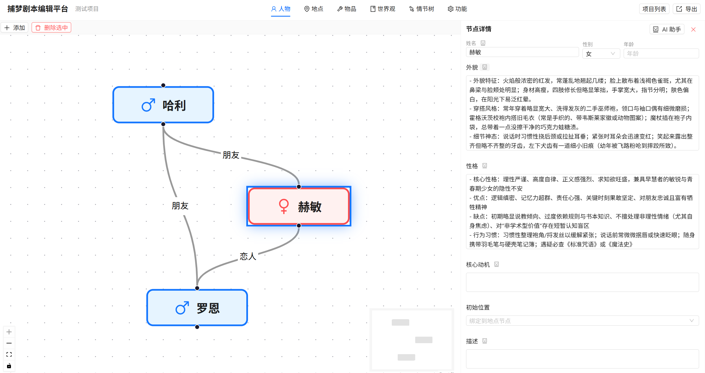
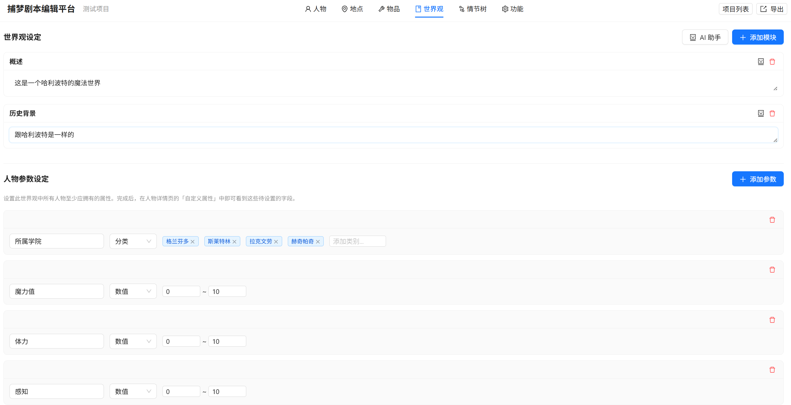
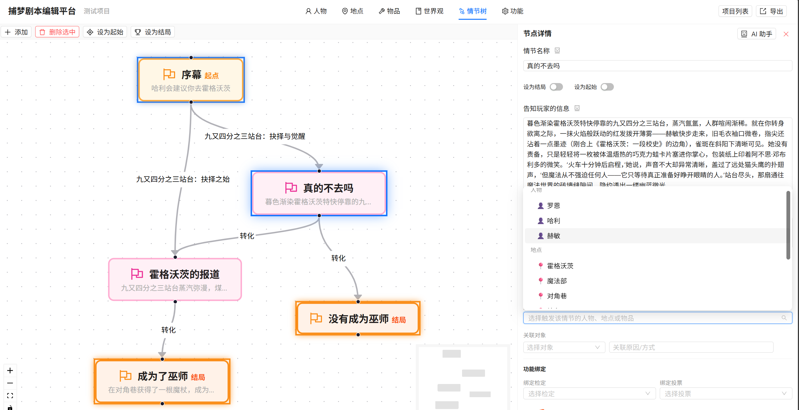
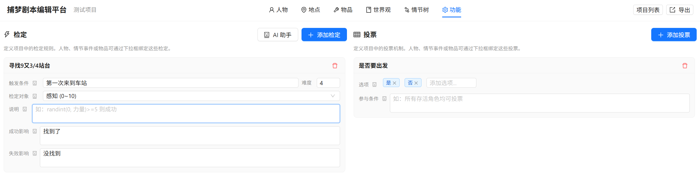

# Script Builder —— 剧本杀与小说创作平台

基于图结构的可视化剧本创作工具，支持人物关系图、地点拓扑图、物品关联图、情节树编辑，以及游戏机制（检定/投票）管理，并集成 AI 辅助创作。

---

## 技术栈

| 层级           | 技术                   | 说明                                               |
| -------------- | ---------------------- | -------------------------------------------------- |
| **前端** | React 18 + TypeScript  | UI 框架                                            |
|                | Ant Design 5           | 组件库（Layout / Tabs / Form / Modal / Slider 等） |
|                | React Flow 11          | 图可视化编辑（关系图 / 拓扑图 / 情节树 / 物品图）  |
|                | Zustand                | 全局状态管理 + 自动保存                            |
|                | Axios                  | HTTP 客户端                                        |
| **后端** | FastAPI (Python 3.10+) | Web 框架                                           |
|                | OpenAI                 | LLM 调用（兼容 OpenAI API，优先 Qwen）             |
|                | Pydantic 2             | 数据校验                                           |
|                | Uvicorn                | ASGI 服务器                                        |
| **存储** | JSON 文件              | 按用户分目录，无数据库依赖                         |

---

## 目录结构

```
script-builder/
├── frontend/                  # React 前端
│   ├── public/
│   │   └── index.html
│   ├── src/
│   │   ├── api/index.ts               # 全部 API 调用
│   │   ├── components/
│   │   │   ├── AIPanel/AIPanel.tsx     # AI 创作助手面板
│   │   │   ├── DetailPanel/DetailPanel.tsx  # 右侧详情编辑
│   │   │   ├── GraphCanvas/
│   │   │   │   ├── GraphCanvas.tsx          # 图编辑画布（核心）
│   │   │   │   ├── CustomCharacterNode.tsx  # 人物节点
│   │   │   │   ├── CustomLocationNode.tsx   # 地点节点
│   │   │   │   ├── CustomItemNode.tsx       # 物品节点
│   │   │   │   └── CustomCheckpointNode.tsx # 情节检查点节点
│   │   │   └── Layout/MainLayout.tsx   # 顶部工具栏
│   │   ├── pages/
│   │   │   ├── CharacterPage.tsx       # 人物页面
│   │   │   ├── LocationPage.tsx        # 地点页面
│   │   │   ├── ItemPage.tsx            # 物品页面
│   │   │   ├── WorldviewPage.tsx       # 世界观页面
│   │   │   ├── PlotPage.tsx            # 情节树页面
│   │   │   └── MechanicsPage.tsx       # 功能页面（检定/投票）
│   │   ├── store/useProjectStore.ts    # Zustand 全局 store
│   │   ├── types/index.ts             # TypeScript 类型定义
│   │   ├── utils/export.ts            # 导出功能
│   │   ├── App.tsx                    # 根组件（路由 + 项目列表）
│   │   └── index.tsx                  # 入口
│   └── package.json
│
└── backend/                   # FastAPI 后端
    ├── main.py                        # 入口（CORS 配置 + 路由注册）
    ├── requirements.txt               # Python 依赖
    ├── .env                           # 环境变量（API Key）
    ├── models/schemas.py              # Pydantic 数据模型
    ├── routers/
    │   ├── projects.py                # 项目 CRUD API
    │   └── ai.py                      # AI 生成 API
    ├── services/
    │   ├── file_store.py              # JSON 文件存储
    │   └── ai_service.py              # OpenAI 调用 + Prompt 模板
    └── projects/                      # 项目数据存储目录
        └── user1/
```

---

## 部署方法

### 1. 环境要求

- **Node.js** ≥ 18
- **Python** ≥ 3.10
- **npm** ≥ 9

### 2. 后端部署

```bash
cd script-builder/backend

# 创建虚拟环境（推荐）
python -m venv venv
# Windows:
venv\Scripts\activate
# macOS/Linux:
source venv/bin/activate

# 安装依赖
pip install -r requirements.txt

# 配置环境变量
# 编辑 .env 文件，填入你的 OpenAI API Key 和 Base URL
# OPENAI_API_KEY=sk-xxxxx
# OPENAI_BASE_URL=https://api.openai.com/v1

# 启动后端（默认端口 8000）
python main.py
```

后端启动后，API 文档自动可用：http://localhost:8000/docs

### 3. 前端部署

```bash
cd script-builder/frontend

# 安装依赖
npm install

# 启动开发服务器（默认端口 3000）
npm start
```

前端启动后访问：http://localhost:3000

### 4. 验证

1. 打开 http://localhost:3000
2. 点击「新建项目」或「打开项目」创建/选择一个项目
3. 在画布上自由编辑人物、地点、物品、情节节点

---

## 主要模块

### 前端

| 模块                 | 文件                                                                                                                | 功能                                                                                                                                                                                                                                                                                                                                                                                      |
| -------------------- | ------------------------------------------------------------------------------------------------------------------- | ----------------------------------------------------------------------------------------------------------------------------------------------------------------------------------------------------------------------------------------------------------------------------------------------------------------------------------------------------------------------------------------- |
| **图编辑画布** | `GraphCanvas.tsx`                                                                                                 | 基于 React Flow 封装的通用画布，支持节点拖拽、连线、吸附网格、缩放，通过 `onNodeClick`/`onEdgeClick`/`onPaneClick` 精确控制选中状态                                                                                                                                                                                                                                                 |
| **自定义节点** | `CustomCharacterNode.tsx<br>``CustomLocationNode.tsx<br>``CustomItemNode.tsx<br>``CustomCheckpointNode.tsx` | 人物节点（显示姓名 + 别名）、地点节点（显示名称 + 类型）、物品节点（显示名称）、情节节点（显示标题 + 序号），起始检查点带绿色标识                                                                                                                                                                                                                                                         |
| **详情面板**   | `DetailPanel.tsx`                                                                                                 | 根据选中元素类型渲染对应表单：人物→姓名/性别/年龄/外貌/性格/核心动机/初始位置/描述/世界参数；地点→标签/类型/地貌/描述；物品→名称/外观/功能/获得方式/初始所在；边→关系/描述/条件。每个文本字段右侧有 AI 填充按钮；TextArea 自动随内容扩展；数值型世界参数使用 Slider 拖动条（tooltip 始终可见，默认取中间值向上取整）；触发条件和关联对象下拉框包含人物、地点、物品和功能（检定/投票） |
| **AI 面板**    | `AIPanel.tsx`                                                                                                     | 右侧抽屉，输入指令调用后端 OpenAI API，根据当前页面类型自动拼接上下文生成内容                                                                                                                                                                                                                                                                                                             |
| **顶部工具栏** | `MainLayout.tsx`                                                                                                  | 项目列表切换、六个编辑页面 Tab（人物/地点/物品/世界观/情节树/功能）、导出按钮                                                                                                                                                                                                                                                                                                             |
| **功能页面**   | `MechanicsPage.tsx`                                                                                               | 管理游戏机制：检定（含触发条件/对象/难度/说明/成功影响/失败影响）和投票（含选项/参与条件），每个单值属性右侧有独立 AI 填充按钮                                                                                                                                                                                                                                                            |
| **全局 Store** | `useProjectStore.ts`                                                                                              | Zustand store，管理项目数据（nodes/edges/worldBlocks/plotData/items/mechanics/characterParams）、选中状态，并内建 debounce 2 秒自动保存到后端                                                                                                                                                                                                                                             |
| **导出工具**   | `export.ts`                                                                                                       | 支持三种导出：完整项目 JSON、LangGraph State 结构化数据（含人物/地点/物品/情节/世界观）、Python 初始化代码                                                                                                                                                                                                                                                                                |

### 后端

| 模块                | 文件                       | 功能                                                                                                                                                               |
| ------------------- | -------------------------- | ------------------------------------------------------------------------------------------------------------------------------------------------------------------ |
| **项目 CRUD** | `routers/projects.py`    | 创建/查询/更新/删除/列出项目，支持按用户隔离                                                                                                                       |
| **AI 生成**   | `routers/ai.py`          | 接收前端指令 + 当前页面上下文，调用 `ai_service.py` 生成内容；还提供字段级 AI 填充（`fill-field`）端点、AI 直接修改项目 JSON（`modify`）及撤销（`undo`）   |
| **AI 服务**   | `services/ai_service.py` | 封装 OpenAI/Qwen 调用，内置 Prompt 模板（角色/地点/情节/世界观/字段填充），支持 JSON 模式输出                                                                      |
| **文件存储**  | `services/file_store.py` | 按 `projects/{user_id}/{project_id}.json` 路径读写 JSON                                                                                                          |
| **数据模型**  | `models/schemas.py`      | Pydantic 模型定义（ProjectData, NodeData, EdgeData, GraphData, WorldBlock, PlotData, MechanicsData, CheckDefinition, VoteDefinition, CharacterParamDefinition 等） |

---

## 数据模型

核心数据对象 `ProjectData` 包含以下字段：

| 字段                | 类型                           | 说明                                                                |
| ------------------- | ------------------------------ | ------------------------------------------------------------------- |
| `projectId`       | `string`                     | 项目唯一 ID                                                         |
| `title`           | `string`                     | 项目名称                                                            |
| `worldSetting`    | `WorldBlock[]`               | 世界观文本块数组（标题 + Markdown 内容）                            |
| `characterParams` | `CharacterParamDefinition[]` | 人物自定义参数定义，支持类型（category 分类选择 / number 数值滑块） |
| `characters`      | `GraphData`                  | 人物图（nodes + edges）                                             |
| `locations`       | `GraphData`                  | 地点图                                                              |
| `items`           | `GraphData`                  | 物品图                                                              |
| `plot`            | `PlotData`                   | 情节数据（初始检查点、结束检查点列表、有向图）                      |
| `mechanics`       | `MechanicsData`              | 游戏机制（检定列表 + 投票列表）                                     |
| `aiConfig`        | `AIConfig?`                  | AI 配置（可选模型设置）                                             |

**关键类型**：

- **`CheckDefinition`**：检定定义 — `id`, `name`, `triggerCondition`, `difficulty`, `checkTarget`, `description`, `successEffect`, `failureEffect`
- **`VoteDefinition`**：投票定义 — `id`, `name`, `options[]`, `participationCondition`
- **`CharacterParamDefinition`**：人物参数定义 — `name`, `paramType`（`'category' | 'number'`）, `categories[]`, `minValue`, `maxValue`
- **`PlotData`**：`initialCheckpoint`, `endCheckpoints[]`, `graph: GraphData`
- **`NodeData.data`** 扩展字段：`triggerConditions[]`（支持 `"character:id"`, `"location:id"`, `"item:id"`, `"check:id"`, `"vote:id"`）、`associatedObjects[]`、`boundChecks[]`、`boundVotes[]`、`worldParams`、`potentialActions` 等

---

## 使用方法

### 1. 项目入口

打开 http://localhost:3000 → 弹出项目选择框 → 可新建或选择已有项目。

### 2. 人物编辑

切换到「人物」Tab：

- **添加角色**：右键画布空白处 → 添加节点，或点击右侧「+ 添加角色」
- **编辑角色**：点击角色节点 → 右侧面板显示详情表单（姓名、别名、性别、年龄、外貌、性格、核心动机、初始位置、描述、自定义属性）
- **世界参数**：每个角色可配置分类选择或数值滑块参数，数值型默认取中间值（向上取整），当前值始终可见
- **建立关系**：从节点底部连接点拖拽到另一个节点 → 弹出关系标签输入 → 点击连线可编辑关系详情
- **删除**：选中节点或边后按 `Backspace` / `Delete`



### 3. 地点编辑

切换到「地点」Tab：

- 操作逻辑与人物页面一致，节点代表场景/地点
- 边代表路径或方位关系
- 编辑时可选地点类型（室内/室外/建筑等）、地貌描述

### 4. 物品编辑

切换到「物品」Tab：

- 图结构中节点代表关键物品（道具、线索等）
- 编辑内容包括：名称、外观、功能、获得方式、初始所在位置
- 边可表示物品之间的关联关系

### 5. 世界观编辑

切换到「世界观」Tab：

- 以文本块列表形式编辑世界观设定
- 每块含标题和正文内容（支持 Markdown）
- 支持增删文本块



### 6. 情节树编辑

切换到「情节树」Tab：

- 有向图结构，节点代表剧情检查点，边代表情节推进
- 可右键节点设定为「起始检查点」或「结束检查点」
- 编辑内容包括：场景描述、达成条件、触发条件、关联对象（人物/地点/物品/功能）、绑定检定/投票



### 7. 功能编辑（检定/投票）

切换到「功能」Tab：

- 左侧列表管理检定和投票定义
- **检定**：配置触发条件、鉴定对象、难度、说明、成功影响、失败影响
- **投票**：配置投票选项、参与条件
- 每个单值属性右侧有独立 🤖 AI 填充按钮
- 检定和投票可被情节节点的触发条件引用



### 8. AI 辅助创作

- 点击顶部「AI 助手」按钮 → 打开右侧抽屉
- 在输入框描述需求（如"生成一个神秘的反派角色"）
- 系统会根据当前 Tab 自动拼接合适的前缀上下文
- 生成结果后可直接复制使用

### 9. AI 字段填充

- 在详情编辑面板和功能页面中，每个文本属性右侧都有一个 🤖 AI 按钮
- 点击按钮后，后台会将完整项目 JSON 发送给 AI（qwen-plus），AI 根据项目上下文智能填充该字段
- 如果字段已有内容（如尚未充实成句子的关键词），AI 会在现有内容基础上进行扩充和润色
- AI 响应期间显示 loading 动画，不影响创作者的其它正常操作
- AI 返回的分析过程仅打印到浏览器控制台，不显示在页面上

### 10. AI 直接修改（暂未启用）

- 支持通过 AI 直接修改项目 JSON，修改前自动备份项目数据
- 修改后可通过「撤销上次 AI 修改」回退

### 11. 导出

点击顶部「导出」按钮，支持三种格式：

- **导出完整项目**：包含画布坐标、UI 状态的完整 JSON，用于备份和恢复
- **导出 LangGraph State**：去除 UI 字段的结构化数据（含人物/地点/物品/情节/世界观），适用于下游 Pipeline
- **导出 Python 代码**：生成 `initial_state = {...}` Python 初始化代码

### 12. 自动保存

编辑操作后约 2 秒自动保存到后端，无需手动操作。

---

## 页面 Tab 总览

| Tab    | 组件              | 编辑类型          | 图结构     |
| ------ | ----------------- | ----------------- | ---------- |
| 人物   | `CharacterPage` | 图 + 右侧详情面板 | 人物关系图 |
| 地点   | `LocationPage`  | 图 + 右侧详情面板 | 地点拓扑图 |
| 物品   | `ItemPage`      | 图 + 右侧详情面板 | 物品关联图 |
| 世界观 | `WorldviewPage` | 文本块列表        | 无图       |
| 情节树 | `PlotPage`      | 图 + 右侧详情面板 | 有向情节图 |
| 功能   | `MechanicsPage` | 检定/投票表单     | 无图       |

---

## API 端点

| 方法       | 路径                     | 说明                                       |
| ---------- | ------------------------ | ------------------------------------------ |
| `GET`    | `/api/projects`        | 列出当前用户所有项目                       |
| `POST`   | `/api/projects`        | 创建项目                                   |
| `GET`    | `/api/projects/{id}`   | 获取项目详情                               |
| `PUT`    | `/api/projects/{id}`   | 全量更新项目                               |
| `PATCH`  | `/api/projects/{id}`   | 部分更新项目（自动保存用）                 |
| `DELETE` | `/api/projects/{id}`   | 删除项目                                   |
| `POST`   | `/api/ai/generate`     | AI 生成内容                                |
| `GET`    | `/api/ai/history/{id}` | 获取项目 AI 聊天历史                       |
| `POST`   | `/api/ai/modify`       | AI 直接修改项目 JSON（自动备份）           |
| `POST`   | `/api/ai/undo/{id}`    | 撤销上一次 AI 修改                         |
| `POST`   | `/api/ai/fill-field`   | AI 填充单个字段（返回 analysis + content） |

---

## 配置说明

### 环境变量（`.env`）

```ini
OPENAI_API_KEY=sk-your-key-here
OPENAI_BASE_URL=https://api.openai.com/v1
```

- `OPENAI_API_KEY`：你的 OpenAI（或兼容服务）API Key
- `OPENAI_BASE_URL`：API 端点地址，支持任何 OpenAI 兼容服务（如 Azure OpenAI、本地模型等）

### 前端 API 地址

默认指向 `http://localhost:8000/api`，在 `src/api/index.ts` 中配置。如需修改，编辑 `baseURL` 即可。


# 后续需求

1. AI直接对画布进行修改，只添加不删除
2. 在创作平台上对数值平衡进行引导
3. 创作平台上设置一些模板，可以让创作者直接拖拽进来（这可能涉及到添加数据库）
4. 哪些角色是可以让玩家扮演的，哪些只能由NPC来扮演
